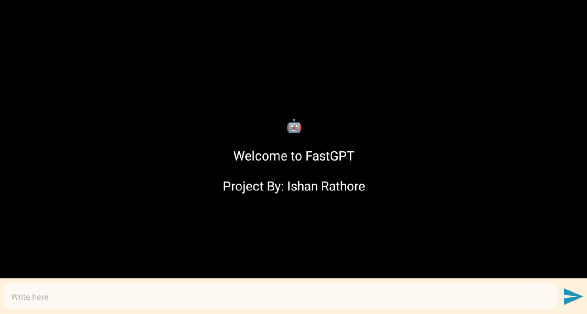
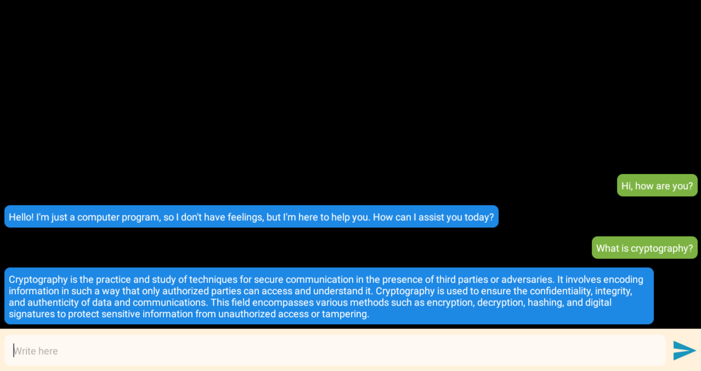

# <i>
# FastGPT
# Description
<i>FastGPT is a free, open-source implementation of the GPT architecture that requires no account and offers unlimited usage. It provides rapid text generation and high performance through an easy-to-use API. 

# Links: 
[Download Here](https://github.com/Ishan1998/FastGPT/raw/refs/heads/main/FastGPT.apk)

# Screenshots

# FastGPT UI

